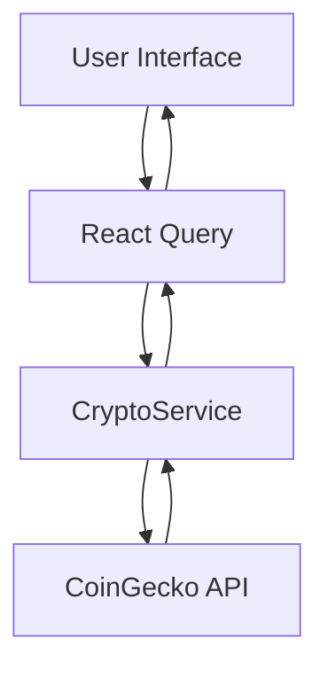

# Technical Architecture

## Overview
The CryptoApp is a web application built using Next.js that provides real-time cryptocurrency price tracking and portfolio management capabilities.

## Core Technologies
- **Next.js 14**: Frontend framework providing server-side rendering and routing
- **TypeScript**: For type-safe code development
- **TailwindCSS**: For styling and responsive design
- **React Query**: For data fetching and state management
- **CoinGecko API**: External API for cryptocurrency data

## Architecture Components

### 1. Frontend Architecture

```
web-app/
├── src/
│   ├── app/                 # Next.js app directory
│   │   ├── page.tsx        # Homepage
│   │   └── layout.tsx      # Root layout
│   ├── components/         # Reusable UI components
│   │   ├── UI/            # Generic UI components
│   │   └── crypto/        # Crypto-specific components
│   ├── lib/               # Utility functions and configurations
│   └── types/             # TypeScript type definitions
└── public/                # Static assets
```

### 2. Key Components

#### Data Fetching Layer
- **CryptoService**: Handles API calls to CoinGecko
- **React Query**: Manages data caching and real-time updates

#### UI Components
- **CryptoTable**: Displays cryptocurrency listings
- **CryptoChart**: Shows price history graphs
- **SearchBar**: Filters cryptocurrencies
- **Navbar**: Navigation and theme switching

### 3. Data Flow



### 4. Features Implemented
- Real-time cryptocurrency price tracking
- Price history visualization
- Cryptocurrency search functionality
- Responsive design for mobile and desktop
- Dark/Light theme switching

### 5. State Management
- **React Query**: For server state management
- **React Context**: For theme preferences

### 6. Performance Optimizations
- Server-side rendering for initial page load
- Image optimization with Next.js Image component
- React Query caching for API responses
- Code splitting and lazy loading

### 7. API Integration
The application integrates with the CoinGecko API for:
- Current cryptocurrency prices
- Historical price data
- Market metadata
- Search functionality

### 8. Deployment
- Deployed on Vercel platform
- Automatic deployments from main branch
- Environment variables management
