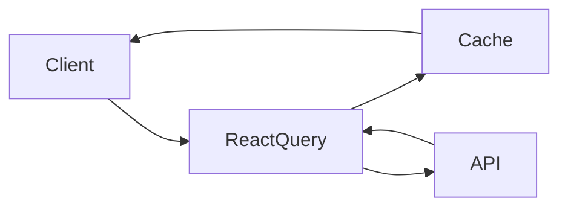

# Technical Architecture

## API Integration

The CryptoApp uses a combination of REST APIs to fetch cryptocurrency data:

### Data Flow


### Implementation Details

```typescript
// Example of API integration using React Query
const { data, isLoading } = useQuery({
  queryKey: ['crypto-prices'],
  queryFn: fetchCryptoPrices,
  staleTime: 30000, // Data considered fresh for 30 seconds
  cacheTime: 3600000 // Cache persists for 1 hour
});
```

## State Management

We chose React Query combined with Zustand for state management due to:

1. **React Query**:
   - Handles server state (API data) with built-in caching
   - Automatic background refetching
   - Loading/error states management
   - Data synchronization across components

2. **Zustand**:
   - Lightweight client state management
   - Simple API without boilerplate
   - DevTools support
   - TypeScript-friendly

```typescript
// Example Zustand store
import create from 'zustand';

interface ThemeStore {
  isDarkMode: boolean;
  toggleTheme: () => void;
}

const useThemeStore = create<ThemeStore>((set) => ({
  isDarkMode: false,
  toggleTheme: () => set((state) => ({ isDarkMode: !state.isDarkMode })),
}));
```

## Development Challenges & Solutions

### 1. Real-time Price Updates

**Challenge**: Implementing real-time cryptocurrency price updates without overwhelming the API or the client.

**Solution**: 
- Implemented smart polling with React Query
- Used WebSocket for critical price updates
- Implemented debouncing for UI updates

```typescript
const POLLING_INTERVAL = 30000; // 30 seconds

const { data } = useQuery({
  queryKey: ['prices'],
  queryFn: fetchPrices,
  refetchInterval: POLLING_INTERVAL,
  refetchOnWindowFocus: false
});
```

### 2. Performance Optimization

**Challenge**: Managing large datasets and preventing unnecessary re-renders.

**Solution**:
- Implemented virtualization for long lists
- Used React.memo for heavy components
- Optimized bundle size with dynamic imports

```typescript
import dynamic from 'next/dynamic';
import { useVirtualizer } from '@tanstack/react-virtual';

// Dynamic import for heavy components
const CryptoChart = dynamic(() => import('@/components/CryptoChart'), {
  ssr: false,
  loading: () => <ChartSkeleton />
});
```

### 3. Data Caching Strategy

**Challenge**: Balancing fresh data with performance and API limits.

**Solution**:
- Implemented tiered caching strategy
- Used stale-while-revalidate pattern
- Optimistic updates for better UX

```typescript
const queryClient = new QueryClient({
  defaultOptions: {
    queries: {
      staleTime: 1000 * 60, // 1 minute
      cacheTime: 1000 * 60 * 60, // 1 hour
      retry: 3,
      retryDelay: (attemptIndex) => Math.min(1000 * 2 ** attemptIndex, 30000),
    },
  },
});
```

### 4. Error Handling

**Challenge**: Graceful error handling across different API endpoints and scenarios.

**Solution**:
- Implemented global error boundary
- Created custom error hooks
- Added retry logic with exponential backoff

```typescript
const useErrorHandler = () => {
  const queryClient = useQueryClient();
  
  return useCallback((error: Error) => {
    if (error.message.includes('rate limit')) {
      queryClient.cancelQueries();
      // Implement retry with exponential backoff
    }
    // Handle other error types
  }, [queryClient]);
};
```
